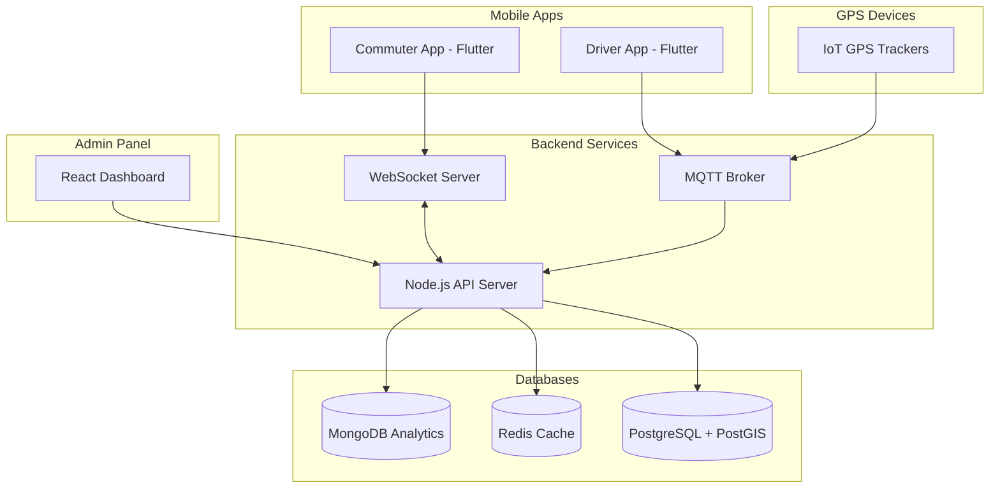

# 🚌 SmartBus Tracker - Real-Time Bus Tracking System

A production-ready real-time bus tracking system with Zomato-like live tracking interface, built for Smart India Hackathon (SIH).


## 🎯 Overview

SmartBus Tracker is a comprehensive bus tracking solution that provides real-time location tracking, ETA calculations, and route management. The system features a Flutter mobile app for commuters, a React admin dashboard for transport authorities, and a robust Node.js backend with MQTT support for real-time GPS updates.

### Key Features

- **🗺️ Real-Time Tracking**: Live bus location updates every 5 seconds via MQTT/WebSocket
- **📱 Mobile App**: Flutter app with Zomato-like tracking interface
- **🖥️ Admin Dashboard**: React-based control panel for transport authorities
- **⚡ High Performance**: Redis caching, PostgreSQL with PostGIS, MongoDB for analytics
- **🔔 Smart Notifications**: Push notifications for bus arrivals
- **📊 Analytics**: Comprehensive reporting and insights
- **🐳 Docker Ready**: Fully containerized for easy deployment

## 🏗️ System Architecture



### Data Flow

1. **GPS Data Collection**: Buses send location updates via MQTT (IoT devices) or mobile app
2. **Real-Time Processing**: MQTT broker receives and processes GPS data
3. **Data Storage**: Location stored in Redis (cache) and PostgreSQL (persistent)
4. **WebSocket Broadcasting**: Real-time updates pushed to connected clients
5. **API Access**: REST APIs for data retrieval and management
6. **Analytics**: Historical data aggregated in MongoDB

## 🚀 Tech Stack

### Frontend - Mobile App
- **Framework**: Flutter 3.0+
- **Maps**: Google Maps SDK
- **State Management**: Riverpod
- **Real-Time**: Socket.io Client, MQTT
- **UI**: Material 3 Design
- **Notifications**: Firebase Cloud Messaging

### Backend
- **Runtime**: Node.js 20 LTS
- **Framework**: Express.js
- **Real-Time**: Socket.io, MQTT (Mosquitto)
- **Databases**: 
  - PostgreSQL 15 with PostGIS (Main DB)
  - Redis 7 (Caching & Real-time data)
  - MongoDB 6 (Analytics & History)
- **Authentication**: JWT
- **Validation**: Express Validator

### Admin Dashboard
- **Framework**: React 18 with Vite
- **UI**: Tailwind CSS 3
- **Maps**: Mapbox GL JS
- **Charts**: Chart.js, Recharts
- **State**: Zustand, React Query
- **Components**: Headless UI, Heroicons

### DevOps
- **Containerization**: Docker & Docker Compose
- **Reverse Proxy**: Nginx
- **Monitoring**: Portainer
- **Database Management**: pgAdmin

## 📂 Project Structure

```
smartbus-tracker/
├── mobile-app/              # Flutter mobile application
│   ├── lib/
│   │   ├── screens/        # App screens
│   │   ├── widgets/        # Reusable widgets
│   │   ├── services/       # API & Socket services
│   │   ├── models/         # Data models
│   │   └── providers/      # State management
│   └── pubspec.yaml
│
├── backend/                 # Node.js backend server
│   ├── routes/             # API routes
│   ├── controllers/        # Route controllers
│   ├── services/           # Business logic
│   ├── models/             # Database models
│   ├── middleware/         # Express middleware
│   ├── config/             # Configuration files
│   └── server.js           # Main server file
│
├── admin-dashboard/         # React admin panel
│   ├── src/
│   │   ├── pages/          # Dashboard pages
│   │   ├── components/     # React components
│   │   ├── services/       # API services
│   │   └── store/          # State management
│   └── package.json
│
├── database/               # Database schemas
│   └── schema.sql          # PostgreSQL schema
│
├── docker/                 # Docker configuration
│   ├── docker-compose.yml  # Multi-container setup
│   └── nginx/             # Nginx configuration
│
└── docs/                   # Documentation
```

## 🛠️ Installation & Setup

### Prerequisites

- Node.js 20+ LTS
- Docker & Docker Compose
- Flutter SDK 3.0+
- PostgreSQL 15 (or use Docker)
- Redis 7 (or use Docker)
- MongoDB 6 (or use Docker)

### Quick Start with Docker

1. **Clone the repository**
```bash
git clone https://github.com/yourusername/smartbus-tracker.git
cd smartbus-tracker
```

2. **Set up environment variables**
```bash
cp .env.example .env
# Edit .env with your configurations
```

3. **Start all services with Docker**
```bash
cd docker
docker-compose up -d
```

4. **Access the services**
- Backend API: http://localhost:3000
- Admin Dashboard: http://localhost:5173
- pgAdmin: http://localhost:5050
- Portainer: http://localhost:9000

### Manual Setup

#### Backend Setup
```bash
cd backend
npm install
npm run migrate  # Run database migrations
npm run seed     # Seed initial data
npm start        # Start server
```

#### Admin Dashboard Setup
```bash
cd admin-dashboard
npm install
npm run dev      # Development mode
npm run build    # Production build
```

#### Mobile App Setup
```bash
cd mobile-app
flutter pub get
flutter run      # Run on connected device/emulator
```

## 🔧 Configuration

### Environment Variables

Create a `.env` file in the root directory:

```env
# Database
POSTGRES_PASSWORD=smartbus2024
REDIS_PASSWORD=redis2024
MONGO_PASSWORD=mongo2024

# JWT
JWT_SECRET=your-jwt-secret-key-2024

# MQTT
MQTT_USERNAME=smartbus
MQTT_PASSWORD=mqtt2024

# Maps
MAPBOX_TOKEN=your-mapbox-token
GOOGLE_MAPS_API_KEY=your-google-maps-key

# Firebase
FIREBASE_SERVER_KEY=your-firebase-key

# Admin
PGADMIN_EMAIL=admin@smartbus.com
PGADMIN_PASSWORD=admin2024
```

## 📡 API Documentation

### Base URL
```
http://localhost:3000/api
```

### Endpoints

#### Bus Management
- `GET /api/buses` - Get all buses
- `GET /api/buses/nearby?lat=&lng=&radius=` - Get nearby buses
- `GET /api/buses/:id/location` - Get real-time bus location
- `GET /api/buses/:id/eta/:stopId` - Get ETA for a stop
- `POST /api/buses` - Create new bus (Admin)
- `PUT /api/buses/:id` - Update bus details (Admin)

#### Routes
- `GET /api/routes` - Get all routes
- `GET /api/routes/:id` - Get route details
- `GET /api/routes/:id/buses` - Get buses on route
- `POST /api/routes` - Create route (Admin)

#### Real-Time Tracking
- `GET /api/tracking/live` - WebSocket endpoint for live tracking
- `POST /api/tracking/subscribe` - Subscribe to bus updates

#### Authentication
- `POST /api/auth/login` - User login
- `POST /api/auth/register` - User registration
- `POST /api/auth/refresh` - Refresh JWT token

### WebSocket Events

#### Client → Server
- `subscribe_bus` - Subscribe to specific bus updates
- `subscribe_route` - Subscribe to route updates
- `user_location` - Send user location

#### Server → Client
- `bus_location_update` - Real-time bus location
- `bus_arrival_notification` - Bus arrival alert
- `route_update` - Route changes
- `emergency_alert` - Emergency notifications

## 🚦 MQTT Topics

```
bus/{busId}/location     # GPS location updates
bus/{busId}/status       # Bus status changes
driver/{driverId}/update # Driver app updates
iot/{deviceId}/gps       # IoT device GPS data
alerts/+                 # System alerts
emergency/+              # Emergency broadcasts
```

## 🎯 Features in Detail

### For Commuters
- **Live Tracking**: See buses moving in real-time on the map
- **ETA Calculation**: Accurate arrival time predictions
- **Push Notifications**: Alerts when bus is approaching
- **Favorite Routes**: Quick access to frequently used routes
- **Offline Support**: Cached routes and schedules

### For Drivers
- **GPS Broadcasting**: Automatic location sharing
- **Route Navigation**: Turn-by-turn directions
- **Passenger Count**: Update current capacity
- **Emergency Button**: Quick SOS alerts

### For Administrators
- **Fleet Management**: Add/edit buses and routes
- **Live Monitoring**: Real-time fleet visualization
- **Analytics Dashboard**: Performance metrics and reports
- **Alert Management**: Broadcast system-wide notifications
- **Driver Management**: Assign drivers to buses

## 📊 Performance Metrics

- **GPS Update Frequency**: 5 seconds
- **WebSocket Latency**: <100ms
- **API Response Time**: <200ms (avg)
- **Concurrent Users**: 10,000+
- **Data Points/Day**: 1M+

## 🔒 Security Features

- JWT-based authentication
- Role-based access control (RBAC)
- Rate limiting on APIs
- Input validation and sanitization
- HTTPS enforcement
- Docker security best practices

## 🧪 Testing

```bash
# Backend tests
cd backend
npm test

# Frontend tests
cd admin-dashboard
npm test

# Mobile app tests
cd mobile-app
flutter test
```

## 📈 Monitoring & Analytics

- **Logs**: Winston logging with log rotation
- **Metrics**: Performance monitoring
- **Alerts**: Automated error notifications
- **Analytics**: User behavior tracking

## 🚀 Deployment

### AWS Deployment

1. **EC2 Setup**: Launch Ubuntu 22.04 instance
2. **Install Docker**: Follow Docker installation guide
3. **Clone Repository**: Pull code from GitHub
4. **Configure Environment**: Set production variables
5. **Start Services**: Run docker-compose
6. **Setup Domain**: Configure Route 53
7. **SSL Certificate**: Use Let's Encrypt

### Production Checklist

- [ ] Environment variables configured
- [ ] SSL certificates installed
- [ ] Backup strategy implemented
- [ ] Monitoring setup complete
- [ ] Load balancing configured
- [ ] Auto-scaling rules defined
- [ ] Security groups configured
- [ ] Database backups scheduled

## 🤝 Contributing

We welcome contributions! Please follow these steps:

1. Fork the repository
2. Create a feature branch
3. Commit your changes
4. Push to the branch
5. Open a Pull Request

## 📄 License

This project is licensed under the MIT License - see the [LICENSE](LICENSE) file for details.

